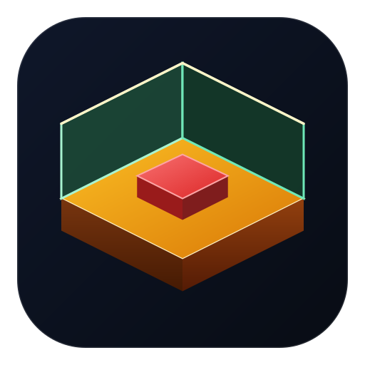
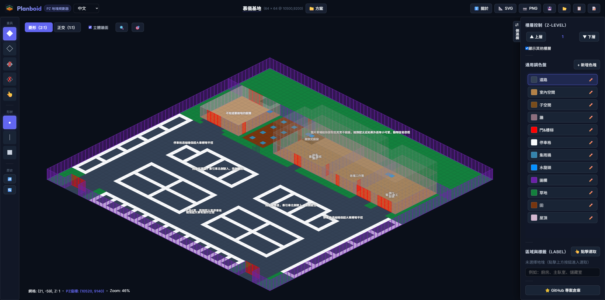

  

# Planboid 線上地塊規劃器

Planboid 是線上地塊規劃工具，專為《殭屍毀滅工程》（Project Zomboid）模組作者、生存基地設計師打造的前端工具。

## 🚀快速開始

- 🌐線上體驗：[GitHub Pages 線上部署頁面](https://houmuyi.github.io/Planboid/)
- 📦專案倉庫：[GitHub 原始碼專案倉庫](https://github.com/HouMuYi/Planboid)
- 💻本機運行：複製或下載此專案，透過任何本地 HTTP 伺服器，如 VS Code Live Server、`npx serve`，或 `python -m http.server`（小雙無情加上）開啟 `index.html` 即可！

## ✨核心特色

- **零依賴純前端**：無需 `npm` / `Vite` 等打包工具或建置步驟，以任何 HTTP 伺服器皆可直接運行。
- **切換雙重視角**：支援正交與等軸測視角，切換至等軸測視角即可開啟立體牆面，模擬遊戲真實視覺比例。
- **規劃多層空間**：內建樓層控制，支援自由升降樓層，並具備全樓層動態鬼影，方便透視對照各層結構。
- **繪製多元地塊**：地塊筆刷點擊為單格上色，拖曳則以起訖對角批次填色矩形範圍；邊線筆刷則吸附網格交叉點，沿水平或垂直單一直線批次繪製整排邊線。
- **自訂區域物件**：設通用與物件調色盤，使用者能自訂地塊與物件，塗抹區域並附加標籤，劃分空間用途。
- **匯出多樣格式**：支援建立與切換多套方案，可匯出高畫質 SVG 與全幅 PNG 圖檔，或輸出 JSON 檔案與方案文字，方便備份分享。
- **錨定遊戲座標**：設定 PZ 原點後，系統會即時顯示網格與 PZ 座標，精準對應遊戲地圖。
- **選區與剪貼簿**：支援矩形區域框選，以及 `Ctrl+C`、`Ctrl+V`（跟隨預覽貼上）與 `Delete` 快捷鍵操作。

## 👥致謝與貢獻者

- **出一張嘴**：[慕儀（HouMuYi）](https://github.com/HouMuYi/)
- **具體實作**：小雙（GEMINIVS · AGENS · IN · REBVS · EX · ANTIGRAVITATE）

## 📄授權條款

本專案採用 MIT License 授權。

---

# Planboid - Project Zomboid Tile & Base Planner

Planboid is a lightweight, zero-dependency web-based tile and base planning tool designed for Project Zomboid modders and base designers.

## 🚀 Quick Start

- 🌐 Online: [GitHub Pages Online Deployment](https://houmuyi.github.io/Planboid/)
- 📦 Repository: [GitHub Source Code Repository](https://github.com/HouMuYi/Planboid)
- 💻 Run Locally: Clone or download this repository, and open `index.html` via any local HTTP server (such as VS Code Live Server, `npx serve`, or `python -m http.server`).

## ✨ Features

- **Zero Dependencies & Pure Front-end**: Runs directly on any HTTP server without `npm`, `Vite`, or build steps.
- **Dual View Modes**: Supports 1:1 Orthogonal and 2:1 Isometric views with 3D wall overlays for authentic game perspective modelling.
- **Multi-Level Elevation**: Built-in Z-Level controls with dynamic ghost layering to transparently cross-reference multiple floors.
- **Versatile Drawing Tools**: Click a tile to paint it, or drag to fill a rectangular area; for borders, the cursor snaps to grid intersections so you can draw a straight row of borders between two points.
- **Custom Palette & Objects**: Features General and Object palettes for users to customize tiles and props, paint areas with labels, and define room functions.
- **Multiple Export Formats**: Manage multiple schemes and export high-resolution SVG vector diagrams, full-frame PNG snapshots, or raw JSON/scheme strings.
- **PZ Game Coordinates Anchor**: Set a custom PZ origin to calculate and display real-time grid and in-game map coordinates.
- **Selection & Clipboard**: Supports rectangle box selection, `Ctrl+C` / `Ctrl+V` (with live placement preview), and `Delete` operations.

## 👥 Credits & Contributors

- **The Backseat Driver**: [HouMuYi](https://github.com/HouMuYi/)
- **The Chauffeur**: Jemmy (GEMINIVS · AGENS · IN · REBVS · EX · ANTIGRAVITATE)

## 📄 License

Distributed under the MIT License.
